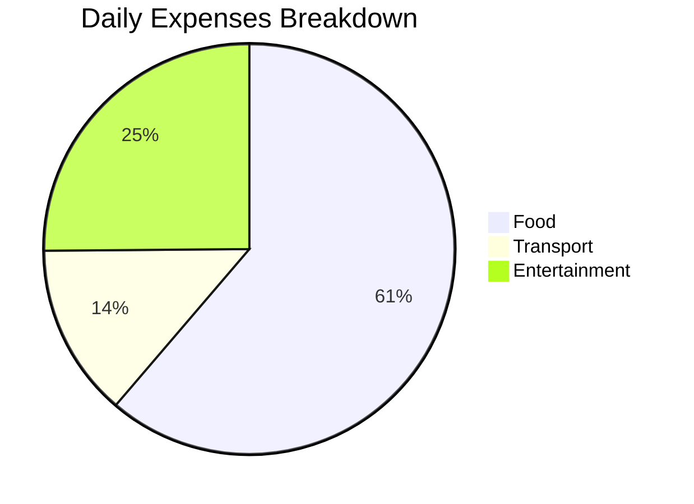
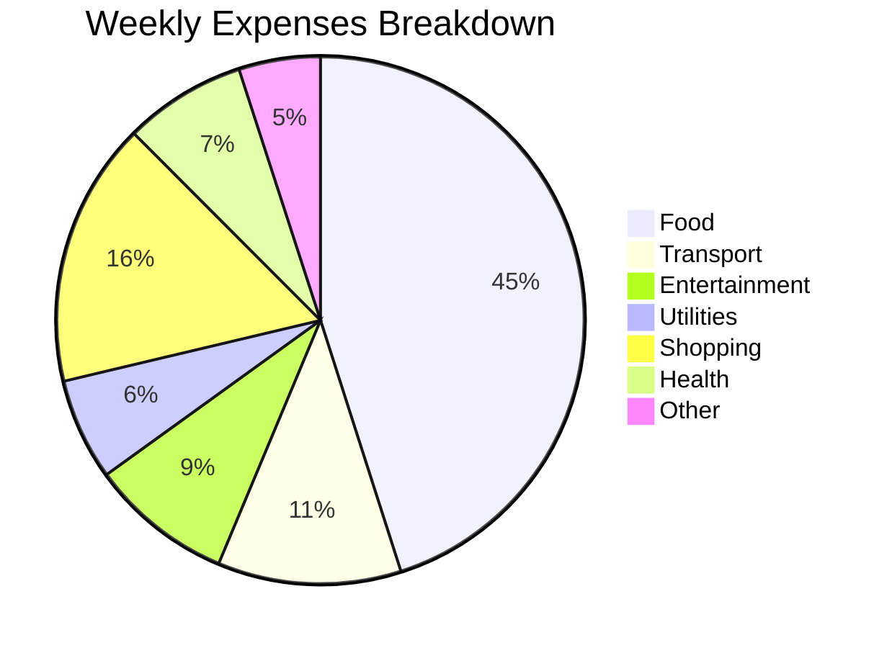
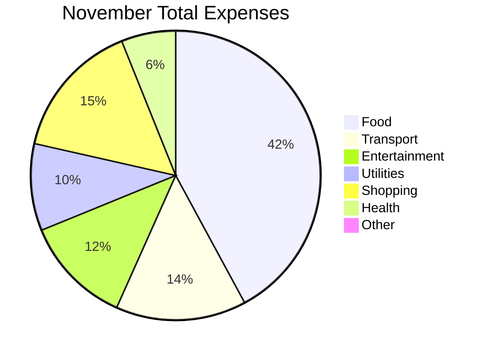

# Daily Life Tracker - 2025

---

## 📅 November 29, 2025

### 💰 Daily Expenses

| Time | Category | Description | Amount |
|------|----------|-------------|--------|
| 09:00 | Food | Breakfast - Coffee & Toast | $5.50 |
| 12:30 | Food | Lunch at office | $8.75 |
| 14:00 | Transport | Uber to office | $6.50 |
| 18:00 | Entertainment | Movie ticket | $12.00 |
| 19:00 | Food | Dinner | $15.00 |

**Daily Total: $47.75**

#### Expenses by Category (Today)



---

### ⏰ Work Hours Log

**Target:** 8 hours
**Actual:** 8.5 hours ✅

| Time | Activity |
|------|----------|
| 09:00 - 09:30 | Morning standup |
| 09:30 - 12:00 | Project development - feature X |
| 12:00 - 13:00 | Lunch break |
| 13:00 - 17:00 | Bug fixes and testing |
| 17:00 - 17:30 | Code review |

**Tasks Completed:**
- ✅ Completed API integration
- ✅ Fixed 3 critical bugs
- ✅ Reviewed team PRs
- ⏳ Started documentation (incomplete)

**Notes:**
- Had a productive morning session
- Great collaboration with team on bug fixes
- Need to prioritize documentation tomorrow

---

### 📝 Full Day Journal

**Mood: 7/10** 😊

**Today's Summary:**
Today was a productive day overall. I started with a good morning standup where we aligned on priorities. The morning coding session was really focused - I managed to complete the API integration feature that was blocked last week. After lunch, I found and fixed three critical bugs that the QA team reported. Had a productive code review session with my colleague. By end of day, I felt good about the progress but also realized I need better time management for documentation.

**Highlights:**
✨ Successfully integrated the payment API - this feature was crucial for the project
✨ Good team collaboration when debugging issues
✨ Completed the morning task 30 minutes ahead of schedule

**Challenges:**
- Got interrupted by meetings in afternoon
- Didn't complete documentation as planned
- Felt slightly tired by 5 PM

**Learning:**
- Breaking tasks into smaller chunks helps with focus
- Asking for help saves debugging time
- Documentation should be prioritized earlier in the day

**Personal Reflection:**
I'm satisfied with today's work. The feeling of resolving bugs and getting features working is rewarding. I need to be more intentional about my schedule tomorrow.

---

### 📊 Key Metrics

| Metric | Value | Status |
|--------|-------|--------|
| Work Hours | 8.5h / 8h | ✅ Above Target |
| Daily Expenses | $47.75 | 💰 Within budget |
| Mood | 7/10 | 😊 Good |
| Productivity Score | 8/10 | ⭐ High |
| Tasks Completed | 4/5 | 80% |
| Sleep Hours | 7h | 😴 Adequate |

---

## 📈 Weekly Summary (Nov 24-29)

### Work Hours Trend

```mermaid
bar
    title Weekly Work Hours
    x-axis [Mon, Tue, Wed, Thu, Fri, Sat]
    y-axis "Hours" 0 --> 9
    bar [8.0, 8.5, 7.5, 8.2, 8.5, 4.0]
```

### Weekly Expenses by Category



### Mood Trend

```mermaid
line
    title Weekly Mood Tracking
    x-axis [Mon, Tue, Wed, Thu, Fri, Sat]
    y-axis "Mood Score (1-10)" 0 --> 10
    line [6, 7, 5, 7, 8, 7]
```

### Weekly Statistics Table

| Day | Work Hours | Expenses | Mood | Productivity |
|-----|-----------|----------|------|--------------|
| Monday | 8.0h | $35.50 | 6/10 | 7/10 |
| Tuesday | 8.5h | $42.75 | 7/10 | 8/10 |
| Wednesday | 7.5h | $38.00 | 5/10 | 6/10 |
| Thursday | 8.2h | $45.00 | 7/10 | 8/10 |
| Friday | 8.5h | $50.25 | 8/10 | 9/10 |
| Saturday | 4.0h | $20.50 | 7/10 | 5/10 |
| **Total** | **44.7h** | **$232.00** | **6.7/10** | **7.2/10** |

---

## 📅 Monthly Overview (November 2025)

### Monthly Expenses Trend

```mermaid
line
    title Monthly Daily Spending
    x-axis [Nov 1, Nov 5, Nov 10, Nov 15, Nov 20, Nov 25, Nov 29]
    y-axis "Daily Spend ($)" 0 --> 100
    line [38, 42, 45, 58, 48, 43, 47]
```

### Monthly Expenses by Category



### Work Hours Performance

```mermaid
bar
    title Monthly Work Hours Achievement
    x-axis [Week 1, Week 2, Week 3, Week 4]
    y-axis "Hours" 0 --> 45
    bar [40, 42, 39, 38]
```

### Monthly Mood Trend

```mermaid
line
    title Monthly Mood Progression
    x-axis [Week 1, Week 2, Week 3, Week 4]
    y-axis "Average Mood (1-10)" 4 --> 9
    line [6.5, 6.8, 6.2, 7.1]
```

### Monthly Statistics Table

| Category | Amount | % of Total | Daily Avg |
|----------|--------|-----------|-----------|
| Food | $520.00 | 41.8% | $17.33 |
| Transport | $180.00 | 14.5% | $6.00 |
| Entertainment | $150.00 | 12.0% | $5.00 |
| Utilities | $120.00 | 9.6% | $4.00 |
| Shopping | $190.00 | 15.3% | $6.33 |
| Health | $75.00 | 6.0% | $2.50 |
| Other | $10.50 | 0.8% | $0.35 |
| **TOTAL** | **$1,245.50** | **100%** | **$41.52** |

### Work Performance Summary

```mermaid
bar
    title Days Meeting Work Target (8 hours)
    x-axis [Met Target, Below Target, Above Target]
    y-axis "Days" 0 --> 20
    bar [18, 2, 10]
```

---

## 🎯 Goals vs Achievements

### Goal Progress Chart

```mermaid
bar
    title Monthly Goals Completion %
    x-axis [API Project, Reduce Expenses, Work Hours, Exercise, Reading]
    y-axis "Progress (%)" 0 --> 100
    bar [100, 65, 95, 70, 40]
```

### Monthly Goals Status

- ✅ Complete API integration project - **100%** (Completed)
- ⏳ Reduce daily expenses to $40/day - **65%** (Current avg: $41.52)
- ✅ Maintain 8+ hours work daily - **95%** (18/20 days achieved)
- ⏳ Read 2 technical books - **40%** (1 book completed, halfway through second)
- ✅ Exercise 4x per week - **70%** (Consistent 3-4 times weekly)

### Key Achievements
1. ✅ Successfully delivered major project feature
2. ✅ Improved team collaboration
3. ✅ Consistent work hours maintained
4. ✅ Better time management implemented

### Areas for Improvement
1. ⚠️ Need to budget better on food expenses
2. ⚠️ Documentation skills need work
3. ⚠️ Should exercise more regularly
4. ⚠️ Better morning routine needed

---

## 📊 Comparative Analysis

### Week-over-Week Comparison

```mermaid
bar
    title Work Hours: Week-over-Week
    x-axis [Week 1, Week 2, Week 3, Week 4]
    y-axis "Hours" 0 --> 50
    bar [40, 42, 39, 38]
```

### Expense Trend (Daily Average)

```mermaid
line
    title Daily Spending Trend
    x-axis [Week 1, Week 2, Week 3, Week 4]
    y-axis "Daily Avg ($)" 35 --> 50
    line [40.5, 41.2, 38.8, 42.1]
```

### Productivity vs Mood Correlation

```mermaid
line
    title Productivity Score vs Mood
    x-axis [Week 1, Week 2, Week 3, Week 4]
    y-axis "Score (1-10)" 4 --> 9
    line [6.8, 7.2, 6.5, 7.4]
```

---

## 📝 Notes for Next Month

- Plan December budget more carefully - aim for $40/day average
- Focus on health and wellness goals - increase exercise to 5x/week
- Schedule documentation time proactively - dedicate 1 hour daily
- Review code review process with team
- Celebrate wins - shipped major feature successfully! 🎉

---

**Last Updated:** November 29, 2025 | **Created by:** Daily Life Tracker

---

## 📌 How to Use This Template

1. **Daily Entry:** Fill in expenses, work hours, and journal entry
2. **Update Mermaid Charts:** Replace data in chart code blocks
3. **Weekly Review:** Update weekly summary sections
4. **Monthly Review:** Update monthly overview at end of month
5. **Commit to GitHub:** Push updates daily/weekly

**File naming:** `2025-11-29.md` or organize by month as `2025-11.md`
