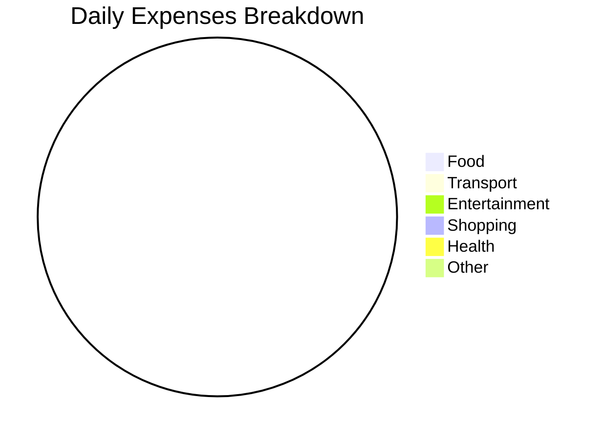

# Daily Entry - [DATE]

**Day:** [Monday/Tuesday/etc.] | **Weather:** [Sunny/Rainy/etc.] ☀️

---

## 💰 Daily Expenses

| Time | Category | Description | Amount |
|------|----------|-------------|--------|
| 09:00 | Food | Breakfast - Coffee & Toast | $0.00 |
| 12:30 | Food | Lunch | $0.00 |
| 18:00 | Food | Dinner | $0.00 |
| 00:00 | Transport | [Description] | $0.00 |
| 00:00 | Entertainment | [Description] | $0.00 |
| 00:00 | Shopping | [Description] | $0.00 |
| 00:00 | Health | [Description] | $0.00 |
| 00:00 | Utilities | [Description] | $0.00 |
| 00:00 | Other | [Description] | $0.00 |

**Daily Total: $0.00**

### Category Breakdown

| Category | Amount | Budget | Status |
|----------|--------|--------|--------|
| Food | $0.00 | $20.00 | ✅ |
| Transport | $0.00 | $10.00 | ✅ |
| Entertainment | $0.00 | $15.00 | ✅ |
| Other | $0.00 | $5.00 | ✅ |
| **TOTAL** | **$0.00** | **$50.00** | ✅ |

#### Expenses by Category (Today)

---

## ⏰ Work Hours Log

**Target:** 8 hours  
**Actual:** 0 hours ⏳

### Time Log

| Time | Activity | Duration |
|------|----------|----------|
| 09:00 - 09:30 | Morning standup | 30 min |
| 09:30 - 12:00 | [Task/Project] | 2.5 hrs |
| 12:00 - 13:00 | Lunch break | 1 hr |
| 13:00 - 17:00 | [Task/Project] | 4 hrs |
| 17:00 - 17:30 | [Activity] | 30 min |

**Total Work Hours:** 0h  
**Break Time:** 0h  
**Overtime:** 0h

### Tasks Completed

- [ ] Task 1 - [Description]
- [ ] Task 2 - [Description]
- [ ] Task 3 - [Description]
- [ ] Task 4 - [Description]
- [ ] Task 5 - [Description]

**Completion Rate:** 0/5 (0%)

### Work Notes

**What I worked on:**
- [Project/Task 1]
- [Project/Task 2]
- [Bug fixes, meetings, etc.]

**Blockers/Challenges:**
- [Any issues faced today]

**Tomorrow's Priority:**
- [What needs to be done next]

---

## 📝 Full Day Journal

**Mood: 5/10** 😐

### Today's Summary

[Write a brief overview of how your day went. What happened? How did you feel? What was the overall experience?]

### Highlights ✨

- [Best moment 1]
- [Best moment 2]
- [Best moment 3]

### Challenges ⚠️

- [Challenge 1 and how you handled it]
- [Challenge 2]
- [Challenge 3]

### Learnings 📚

- [What you learned today]
- [New skill or insight gained]
- [Mistake and lesson learned]

### Personal Reflection 💭

[Deeper thoughts about the day. How are you feeling? What are you thinking about? What could have been better?]

### Gratitude 🙏

Today I'm grateful for:
1. [Thing 1]
2. [Thing 2]
3. [Thing 3]

---

## 💪 Health & Wellness

### Physical Activity

- **Exercise Type:** [Gym/Running/Yoga/None]
- **Duration:** 0 minutes
- **Intensity:** [High/Medium/Low]
- **Calories Burned:** ~0 kcal
- **How I felt:** [Energized/Tired/Great]

### Sleep

- **Bedtime:** 00:00 AM
- **Wake Time:** 00:00 AM
- **Duration:** 0 hours
- **Quality:** 0/10
- **Dreams:** [Yes/No - Any notable dreams?]

### Nutrition

- **Meals:** Breakfast, Lunch, Dinner, Snacks
- **Water Intake:** 0/8 glasses 💧
- **Vegetables/Fruits:** [Yes/No]
- **Junk Food:** [None/Minimal/Moderate]
- **Alcohol:** [None/Type and quantity]
- **Overall:** [Healthy/Average/Poor]

### Mental Health

- **Stress Level:** 0/10
- **Anxiety:** 0/10
- **Focus:** 0/10
- **Energy Level:** 0/10
- **Social Interaction:** [Much/Some/Little/None]

---

## 📚 Learning & Development

### Today's Learning

- **Topic:** [What did you learn/study?]
- **Source:** [Book/Course/YouTube/Mentor/Experience]
- **Time Spent:** 0 minutes
- **Key Takeaway:** [Main thing you learned]

### Skills Practiced

- [ ] Skill 1 - 0 hours
- [ ] Skill 2 - 0 hours
- [ ] Skill 3 - 0 hours

### Books/Courses

**Currently Reading:**
- Book: "[Title]"
- Progress: 0/300 pages (0%)
- Rating So Far: 0/10

**Currently Learning:**
- Course: "[Course Name]"
- Progress: Week 0 of 10
- Completion: 0%

---

## 🎯 Daily Habits Tracker

| Habit | Target | Actual | Status |
|-------|--------|--------|--------|
| Morning Meditation | 10 min | 0 min | ⏳ |
| Exercise | 30 min | 0 min | ⏳ |
| Reading | 30 min | 0 min | ⏳ |
| Journaling | 15 min | 0 min | ⏳ |
| Learning | 60 min | 0 min | ⏳ |
| Water (8 glasses) | 8 | 0 | ⏳ |
| Healthy Meals | 3 | 0 | ⏳ |
| Screen Time Limit | <3 hrs | 0 hrs | ⏳ |

**Habits Completed Today:** 0/8 (0%)

---

## 📊 Key Metrics

| Metric | Value | Target | Status |
|--------|-------|--------|--------|
| Work Hours | 0h | 8h | ⏳ |
| Daily Expenses | $0.00 | $50.00 | ✅ |
| Mood | 5/10 | 7/10 | ⏳ |
| Productivity Score | 0/10 | 8/10 | ⏳ |
| Tasks Completed | 0/5 | 5/5 | ⏳ |
| Exercise | 0 min | 30 min | ⏳ |
| Sleep Hours | 0h | 8h | ⏳ |
| Learning | 0 min | 60 min | ⏳ |
| Habits | 0/8 | 8/8 | ⏳ |

**Overall Day Rating: 0/10**

---

## 🔮 Tomorrow's Plan

### Top 3 Priorities
1. [Most important task]
2. [Second priority]
3. [Third priority]

### Schedule
- 09:00 - [Activity]
- 10:00 - [Activity]
- 14:00 - [Activity]
- 18:00 - [Activity]

### Reminders
- [ ] [Important reminder 1]
- [ ] [Important reminder 2]

---

**Entry Created:** [Date & Time]  
**Last Updated:** [Date & Time]
